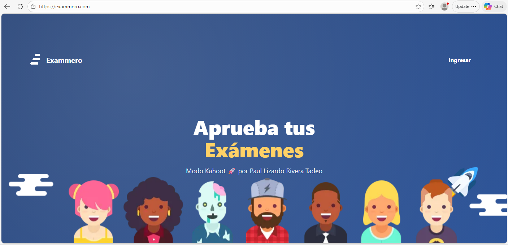
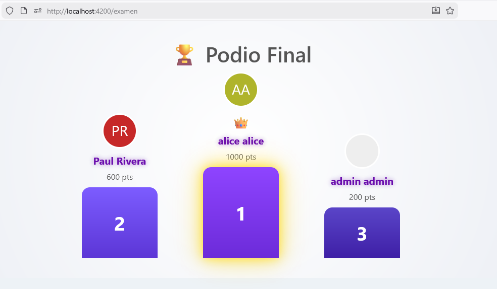
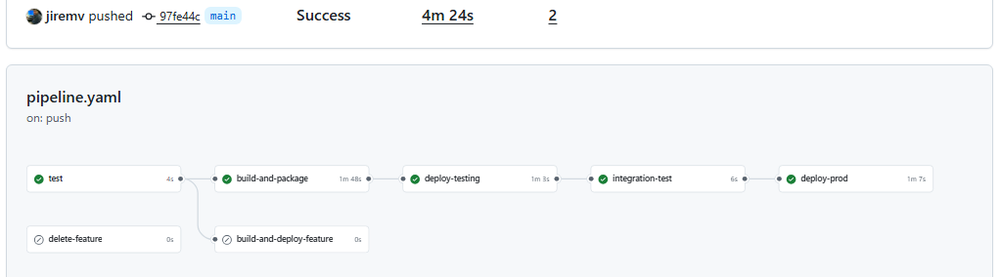

# 🧠 Building a Real-Time Serverless Quiz Platform (Kahoot-style) on AWS  
### Arquitectura, decisiones y lecciones aprendidas

---

## 🌍 Introducción

Construir una plataforma de exámenes online en tiempo real parece sencillo… hasta que necesitas:

- Sincronizar cientos de usuarios en vivo  
- Garantizar baja latencia  
- Mantener consistencia sin estado compartido  
- Escalar sin servidores dedicados  

Este proyecto nace con un objetivo claro:

> **Diseñar una plataforma tipo Kahoot completamente serverless, escalable y orientada a eventos sobre AWS.**

---

## 🏗️ Arquitectura

```
Frontend (Angular)
        │
        ├── API Gateway (REST)
        │        └── AWS Lambda
        │
        └── API Gateway (WebSocket)
                 └── AWS Lambda (Actions)
                          │
                          ├── DynamoDB
                          └── SQS
```

---

## ⚙️ Servicios AWS utilizados

- API Gateway (REST + WebSocket)
- AWS Lambda
- DynamoDB
- SQS
- AWS SAM
- CloudWatch
- GitHub Actions

---

## 🎮 Flujo del juego



1. Host inicia juego  

2. Se cargan preguntas  
3. Se distribuye a jugadores  
4. Jugadores responden  

5. Se calcula ranking  
6. Se muestra podio  


---

## 🧠 Principios clave

- Estado externo en DynamoDB  
- Arquitectura event-driven  
- Separación REST vs WebSocket  
- Escalabilidad serverless  

---

## 🚀 Conclusión

Arquitectura moderna basada en:

- Serverless  
- Event-driven  
- Tiempo real  


---

## 👨‍💻 Autor

Paul Rivera
AWS Certified Solutions Architect
